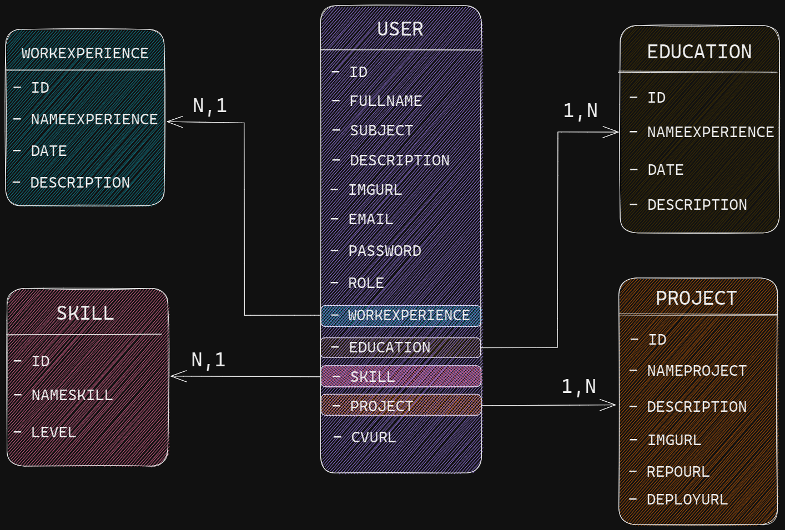

# Sobre el proyecto

Este Portfolio FullStack es el proyecto final de la etapa #YoProgramo de la formación Argentina Programa donde se conoce las bases del desarrollo Web con el stack Java-Angular.

## Objetivo

Desarrollar una aplicación web full stack, que mostrará: tus datos personales, estudios cursados, experiencia laboral, conocimiento de las
tecnologías y lo que desees agregar.

## Requisitos Tecnicos

  - Header: En la parte superior izquierda deberá contener un logo y nombre del programa "Argentina Programa" #YoProgramo. Deberá tener un Banner representativo tuyo. En la parte superior derecha deberá contar con tus redes sociales y un botón que permita el login para la edición.
  - Login: La plataforma deberá contar con acceso el cual deberá ser con username y
password con el objetivo de activar la edición del portfolio Web.
  - Botones:
    - Login/Logout
    - Edición información
    - Borrar información

## Tecnologias Utilizadas
Para este proyecto utilizaremos las tecnologias aprendidas a lo largo del programa:

 - HTML
 - CSS
 - Bootstrap
 - JavaScript
 - Angular
 - Java
 - SpringBoot
 - MySQL

## Producto Minimo Viable (MVP)
Para este proyecto el minimo producto viable (mvp) son cumplir los requisitos tecnicos iniciales y agregar un formulario de contacto y un botón para descargar el CV.

### Diseños
Apoyandome del MVP realice dos diseños iniciales para tener de guía a lo largo del desarrollo del proyecto.

### Diagrama de Flujo del Usuario (User Flow)

  

### Diagrama de Clases

  

## TODO
- [ x ] Objetivo
- [ x ] Requisitos Tecnicos
- [ x ] Diseño
- [  ] Changelog